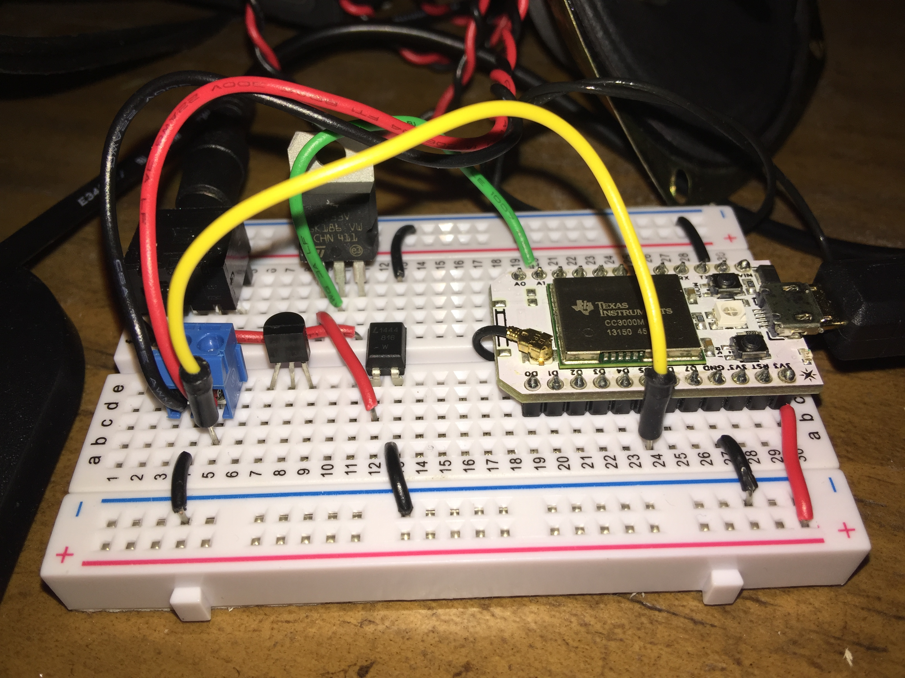

# DrivewayAlarm
This project is to utilize a [Particle.IO Core] (http://docs.particle.io/core/) (Formally Spark.IO), a Cloud enabled IoT device, with signal from a STI Driveway alarm [STI-34100] (http://www.sti-usa.com/Products/Wireless-Driveway-Monitor-solar-powered-STI-34100.htm) and utilizing its lamp controller port to give much greater capabilitity to the alarm system.

##Hardware Used
* Particl.IO Core
* Breadboard
* [Breadboard-Friendly 3.5mm Stereo Headphone Jack ID:1699] (https://www.adafruit.com/product/1699) 
* [3.3V 800mA Linear Voltage Regulator - LD1117V33 ] (https://www.sparkfun.com/products/526)
* [Speaker - 3" Diameter - 8 Ohm 1 Watt ID:1313] (https://www.adafruit.com/product/1313)

## STI Output details
The accessory transistor output jack, where the optional Lamp Controller (STI-30104) plugs in,
will supply 75mA at 12V for three seconds. The output is a 3.5mm mono audio jack and is
polarity sensitive. This output can trigger the Lamp Controller or another low powered devices
such as a relay. It allows the output to interface with many home automation products.

##Options
Alternatively I can use an Opti-isolator to drop the volatage down.  In the picture I have a [1 Channel] (https://www.sparkfun.com/products/314) ready to go
